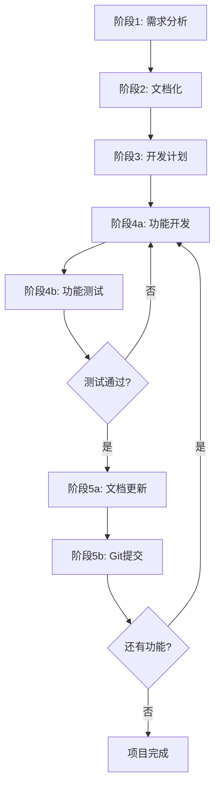

# Go技术博客系统 - SuperClaude分阶段开发案例

## 项目概述

**项目名称**: Go技术文章分享博客系统  
**开发方法**: SuperClaude智能指令驱动的分阶段开发  
**案例版本**: v1.0  
**创建时间**: 2025-01-19

## 核心需求

### 功能需求
1. **首页分类导航栏** - 参考: https://www.cuiliangblog.cn/
2. **三段式文章显示** - 参考: https://www.cuiliangblog.cn/detail/section/15246664
   - 左侧：目录大纲
   - 中间：文章正文  
   - 右侧：文章标题
3. **完善的后台管理**
   - 分类管理
   - Markdown编辑器
   - 评论管理
   - 访问统计

### 技术栈
- **后端**: Go语言
- **前端**: 待选型
- **数据库**: 待选型
- **部署**: 待规划

## SuperClaude分阶段开发流程

### 设计原则
- **渐进式开发**: 从简单到复杂，避免一次性实现过多功能
- **单一功能专注**: 每次只开发一个功能模块
- **文档驱动**: 每个阶段都有对应的文档输出
- **测试优先**: 功能开发完成后立即进行充分测试
- **版本管理**: 及时提交代码和更新文档

---

## 第一阶段：需求理解与功能细节补充

### 🎯 目标
完全理解需求，补充功能细节，提出合理建议，专注核心功能实现

### 📋 SuperClaude指令
```bash
/analyze "Go技术博客系统需求分析：1. 深度理解用户核心需求和使用场景 2. 补充功能细节和边缘情况处理 3. 参考站点功能分析和改进建议 4. 确定MVP核心功能范围 5. 技术栈初步选型建议 6. 数据模型和API设计概要" --persona-architect --persona-mentor --seq --c7 --think --focus architecture --type analysis
```

### 🔍 指令分析
- **主要Persona**: architect(架构思维) + mentor(指导和建议)
- **MCP服务器**: sequential(复杂分析) + context7(最佳实践)
- **思维深度**: --think (中等深度，专注需求分析)
- **特点**: 暂不考虑性能和安全的复杂优化

### 📊 预期输出
- 详细的需求理解报告
- 功能细节补充说明
- MVP功能范围确定
- 技术栈选型建议
- 初步的数据模型设计

---

## 第二阶段：需求文档化保存

### 🎯 目标
将讨论后的需求落地保存成需求分析或设计文档

### 📋 SuperClaude指令
```bash
/document "Go博客系统需求分析文档：1. 功能需求规格说明 2. 用户故事和使用场景 3. 数据模型设计文档 4. API接口设计规范 5. UI/UX设计要求 6. 技术栈选型说明" --persona-scribe --persona-architect --c7 --type requirements --documentation
```

### 🔍 指令分析
- **主要Persona**: scribe(专业文档) + architect(技术架构)
- **MCP服务器**: context7(文档模式和规范)
- **输出类型**: 结构化的需求文档

### 📊 预期输出
- 功能需求规格说明书
- 用户故事和使用场景文档
- 数据模型设计文档
- API接口设计规范
- UI/UX设计要求文档
- 技术栈选型说明

---

## 第三阶段：开发计划制定

### 🎯 目标
分析项目的开发计划，分阶段实施，将开发计划落地成文档

### 📋 SuperClaude指令
```bash
/estimate "Go博客系统开发计划：1. 功能模块拆分和优先级排序 2. 开发里程碑和时间估算 3. 技术风险评估和缓解策略 4. 开发环境和工具链配置 5. 测试策略和质量标准 6. 分阶段交付计划" --persona-architect --persona-devops --seq --c7 --think --type planning --documentation
```

### 🔍 指令分析
- **主要Persona**: architect(整体规划) + devops(环境配置)
- **MCP服务器**: sequential(复杂分析) + context7(最佳实践)
- **类型**: 项目规划和估算

### 📊 预期输出
- 功能模块拆分和优先级
- 开发里程碑和时间表
- 技术风险评估报告
- 开发环境配置指南
- 测试策略和质量标准
- 分阶段交付计划

---

## 第四阶段：单功能开发（循环执行）

### 🎯 目标
按照开发计划依次开发功能，每次只开发一个功能，开发完毕后进行充分测试

### 4a. 功能开发

#### 📋 SuperClaude指令模板
```bash
/implement "[具体功能名称]：1. [功能的详细需求] 2. [数据模型设计] 3. [API接口实现] 4. [前端界面开发] 5. [基础测试覆盖]" --persona-backend --persona-frontend --c7 --magic --think --type feature --with-tests
```

#### 🔍 指令分析
- **主要Persona**: backend(后端开发) + frontend(前端开发)
- **MCP服务器**: context7(框架模式) + magic(UI组件)
- **特点**: 单一功能专注，包含基础测试

### 4b. 功能测试

#### 📋 SuperClaude指令
```bash
/test "[功能名称]测试验证：1. 单元测试覆盖 2. 集成测试验证 3. 功能测试用例 4. 边缘情况测试 5. 性能基础验证" --persona-qa --play --seq --type functional --validate
```

#### 🔍 指令分析
- **主要Persona**: qa(质量保证专家)
- **MCP服务器**: playwright(测试自动化) + sequential(系统测试)
- **特点**: 全面的测试覆盖和验证

### 🔄 功能开发示例

#### 示例1: 用户认证功能
```bash
/implement "用户认证系统：1. 用户注册登录接口 2. JWT令牌管理 3. 权限验证中间件 4. 登录状态前端交互 5. 基础安全验证" --persona-backend --persona-frontend --c7 --magic --think --type feature --with-tests
```

#### 示例2: 文章管理功能
```bash
/implement "文章管理系统：1. 文章CRUD接口 2. Markdown解析和渲染 3. 文章列表和详情页面 4. 分类标签管理 5. 草稿状态管理" --persona-backend --persona-frontend --c7 --magic --think --type feature --with-tests
```

#### 示例3: 分类导航功能
```bash
/implement "分类导航系统：1. 分类层级管理接口 2. 导航栏组件开发 3. 分类页面文章列表 4. 面包屑导航 5. 响应式适配" --persona-frontend --persona-backend --magic --c7 --think --type feature --with-tests
```

---

## 第五阶段：文档更新与版本管理

### 🎯 目标
测试通过后及时更新项目文档和API文档，提交git保存记录

### 5a. 文档更新

#### 📋 SuperClaude指令
```bash
/document "[功能名称]文档更新：1. API文档更新和示例 2. 用户使用说明更新 3. 开发者文档补充 4. 架构图和流程图更新 5. 部署说明更新" --persona-scribe --persona-devops --c7 --type maintenance --documentation
```

#### 🔍 指令分析
- **主要Persona**: scribe(文档专家) + devops(运维专家)
- **目的**: 保持文档与代码同步

### 5b. Git提交和版本管理

#### 📋 SuperClaude指令
```bash
/git "[功能名称]版本提交：1. 代码变更整理和检查 2. 提交信息规范化 3. 分支管理和合并策略 4. 版本标签和发布说明 5. 下个功能分支准备" --persona-devops --persona-scribe --seq --type maintenance
```

#### 🔍 指令分析
- **主要Persona**: devops(版本管理) + scribe(发布说明)
- **特点**: 规范的版本管理流程

---

## 完整开发流程图



## 方法论优势

### 🎯 专注性
- 每个阶段目标明确，避免复杂度过载
- 单一功能开发，降低认知负担

### 📈 渐进性
- 从简单到复杂，逐步完善
- MVP优先，快速验证核心价值

### 🔄 可控性
- 每个功能独立开发和测试，风险可控
- 问题及时发现和解决

### 📝 文档化
- 每个阶段都有对应的文档输出
- 知识和决策过程可追溯

### 🔧 可维护
- 规范的版本管理和文档更新
- 代码质量和可维护性保证

## SuperClaude指令特点分析

### Persona组合策略
- **需求阶段**: architect + mentor (架构思维 + 指导建议)
- **文档阶段**: scribe + architect (专业文档 + 技术架构)
- **规划阶段**: architect + devops (整体规划 + 环境配置)
- **开发阶段**: backend + frontend (全栈开发)
- **测试阶段**: qa (质量保证专家)
- **维护阶段**: scribe + devops (文档 + 版本管理)

### MCP服务器选择
- **sequential**: 复杂分析、系统性思维
- **context7**: 最佳实践、框架模式
- **magic**: UI组件生成
- **playwright**: 自动化测试

### 思维深度控制
- **--think**: 中等深度，适合需求分析和功能开发
- **--think-hard**: 深度分析，适合复杂架构设计
- **--ultrathink**: 超深度，适合企业级系统

## 案例总结

这个Go博客系统开发案例展示了如何使用SuperClaude智能指令系统进行科学的分阶段开发：

1. **智能化**: 每个阶段都有专门的Persona和MCP服务器支持
2. **系统化**: 完整的开发流程，从需求到交付
3. **实用化**: 避免一次性复杂实现，专注可执行性
4. **标准化**: 规范的文档和版本管理流程
5. **可复用**: 指令模板可应用于其他类似项目

通过这种方法，可以确保项目的高质量交付和可持续维护。

---

*案例文档 - SuperClaude智能对话转换器 v2.0*  
*创建时间: 2025-01-19*  
*适用场景: 中大型全栈项目的分阶段开发*